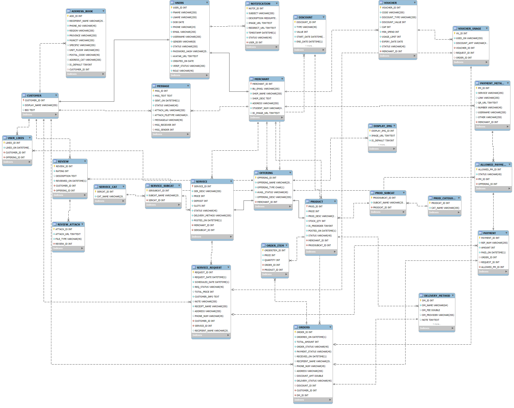

# React + Vite

This template provides a minimal setup to get React working in Vite with HMR and some ESLint rules.

Currently, two official plugins are available:

- [@vitejs/plugin-react](https://github.com/vitejs/vite-plugin-react/blob/main/packages/plugin-react) uses [Oxc](https://oxc.rs)
- [@vitejs/plugin-react-swc](https://github.com/vitejs/vite-plugin-react/blob/main/packages/plugin-react-swc) uses [SWC](https://swc.rs/)

## React Compiler

The React Compiler is not enabled on this template because of its impact on dev & build performances. To add it, see [this documentation](https://react.dev/learn/react-compiler/installation).

## Expanding the ESLint configuration

If you are developing a production application, we recommend using TypeScript with type-aware lint rules enabled. Check out the [TS template](https://github.com/vitejs/vite/tree/main/packages/create-vite/template-react-ts) for information on how to integrate TypeScript and [`typescript-eslint`](https://typescript-eslint.io) in your project.

## How to's

### Open the webapp locally
1. [Import the database from `./src/db/` using MariaDB](#import-the-database-using-mariadb)
2. On your terminal (preferably not on powershell), install necessary dependencies by running `npm install` while on `./xampp/htdocs/iskotmart_frontend/`
3. After a successful install, run `npm run dev`
4. It should return a URL like `http://localhost:5173`. Copy and paste this onto a browser of your choosing.

### Import the database using MariaDB
1. Start Apache and MySQL on XAMPP
2. Open `localhost/phpmyadmin` on your browser.
3. Go to the `Import` tab in the top-middle part of the window.
4. Click `Choose File`, then find the SQL file in `.../iskotmart_frontend/src/db/*.sql`
5. Click `Import`. Then, voila~

## Database Schema
