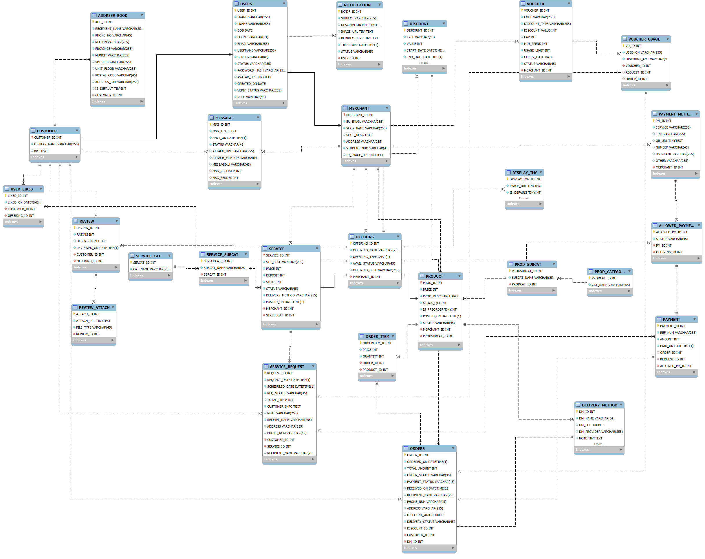

# React + Vite

This template provides a minimal setup to get React working in Vite with HMR and some ESLint rules.

Currently, two official plugins are available:

- [@vitejs/plugin-react](https://github.com/vitejs/vite-plugin-react/blob/main/packages/plugin-react) uses [Oxc](https://oxc.rs)
- [@vitejs/plugin-react-swc](https://github.com/vitejs/vite-plugin-react/blob/main/packages/plugin-react-swc) uses [SWC](https://swc.rs/)

## React Compiler

The React Compiler is not enabled on this template because of its impact on dev & build performances. To add it, see [this documentation](https://react.dev/learn/react-compiler/installation).

## Expanding the ESLint configuration

If you are developing a production application, we recommend using TypeScript with type-aware lint rules enabled. Check out the [TS template](https://github.com/vitejs/vite/tree/main/packages/create-vite/template-react-ts) for information on how to integrate TypeScript and [`typescript-eslint`](https://typescript-eslint.io) in your project.

# How to...

### Open the webapp locally
1. [Import the database from `./db/` using MariaDB](#import-the-database-using-mariadb)
2. Start Apache and MySQL in XAMPP.
3. Place this project in `xampp/htdocs` (for example `C:\xampp\htdocs\iskotmart_frontend`).
4. On your terminal, install dependencies with `npm install`.
5. Run `npm run dev`.
6. Open `http://localhost:5173`.

### Open the webapp with PHP's built-in server
Use this if the repo is not inside XAMPP `htdocs`.

1. Start MySQL in XAMPP.
2. Run `npm run dev:local`.
3. Open `http://localhost:5173`.

`npm run dev:local` starts PHP at `http://127.0.0.1:8000`, points Vite's API proxy there, and stops the PHP process when Vite exits. You can still run `npm run api` and `npm run dev` separately if you prefer two terminals.

### Enable the AI help chatbot
The chatbot uses Groq from the PHP API server. Keep the API key server-side only; do not put it in React code or committed files.

For local development outside `htdocs`, create a local `.env` file in the project root. This file is ignored by Git.

```env
GROQ_API_KEY=your_groq_key_here
GROQ_MODEL=llama-3.1-8b-instant
```

Then start the app:

```powershell
npm run dev:local
```

The chat icon is visible to visitors, but the chatbot only works for logged-in users. Logged-out users see a login prompt, and direct API calls return `401 Not authenticated`.

To debug Groq provider errors locally, add this to `.env` before starting the dev server:

```env
AI_HELP_DEBUG=1
```

Disable debug mode during normal use:

Remove or comment out `AI_HELP_DEBUG=1` in `.env`.

### Audit frontend dependencies
1. Run `npm audit` to check for dependency vulnerabilities.
2. Run `npm audit fix` to apply compatible fixes.
3. Run `npm run build` and `npm run lint` after fixing.
4. Avoid `npm audit fix --force` unless you intend to test possible breaking upgrades.

### Backend target used by Vite
- This frontend is configured for XAMPP-only runtime.
- API calls to `/api/*` are proxied to `http://localhost/iskotmart_frontend` by default.
- If your XAMPP document root path is different, set `VITE_API_PROXY_TARGET` before running Vite.
- If signup says the API returned non-JSON, confirm that the proxy target opens `api/signup.php` through PHP, not as Vite's `index.html` or an Apache/XAMPP HTML error page.

### Import the database using MariaDB
1. Start Apache and MySQL on XAMPP
2. Open `localhost/phpmyadmin` on your browser.
3. Go to the `Import` tab in the top-middle part of the window.
4. Click `Choose File`, then find the SQL file in `.../iskotmart_frontend/db/*.sql` [NOTE: **The most recent file will always be named `iskomartdb.sql`**]
5. Click `Import`. Then, voila~

## Database Schema

